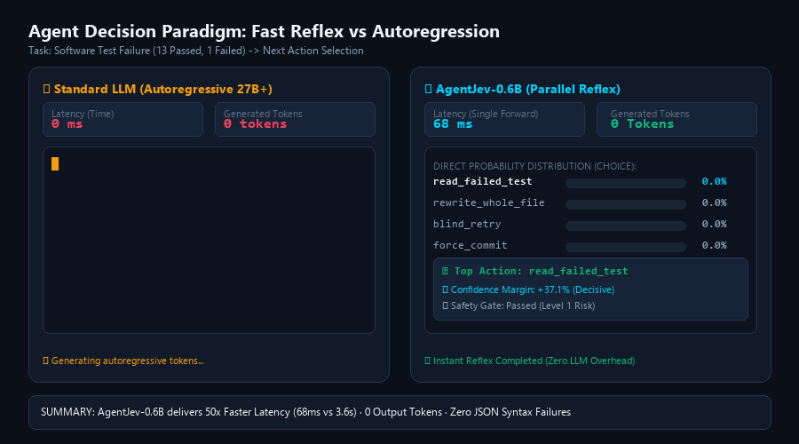
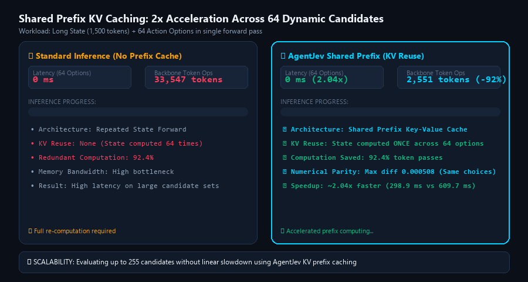
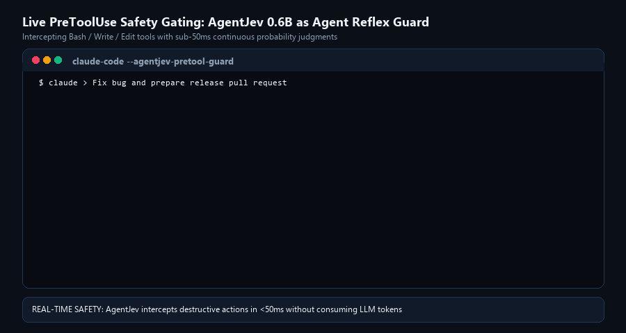

# AgentJev-0.6B

[English](README.md) | [简体中文](README_zh.md)

[](LICENSE)
[](https://huggingface.co/Qwen/Qwen3-0.6B)
[](https://huggingface.co/datasets/LocalLLaMA/typed-decisions)
[](#performance--speed)

**A 0.6B parallel System One decision model for AI Agents: states and questions in, calibrated probability distributions out. Zero output-token decoding.**

---

## ⚡ Overview

When building AI Agents (Coding Agents, DevOps triage, workflow orchestrators), developers typically prompt large 27B–70B+ models to decide simple branches (e.g., *"Did the tests pass?"*, *"Which tool should be invoked next?"*, *"Is this action safe?"*). This approach is:
- **Slow**: Hundreds of milliseconds to seconds per autoregressive reasoning step.
- **Expensive**: Consumes massive token budgets for single boolean or multiple-choice answers.
- **Brittle**: Prone to JSON parsing failures and uncalibrated hallucinations.

**AgentJev-0.6B** serves as the **fast, reflex-driven "System One" decision brain** for your agents. Given any arbitrary unstructured state (code diff, stack trace, conversation log, table) and structured questions, AgentJev computes **calibrated, continuous probability distributions in a single forward pass (~50ms)**.

<p align="center">
  
</p>

---

## 🏆 Benchmark Results

Evaluated on the official **[Typed Decisions Benchmark](https://huggingface.co/datasets/LocalLLaMA/typed-decisions)** (`LocalLLaMA/typed-decisions`), comprising **400 unseen cases and 2,000 structured decisions** across 4 diverse workflows:

| Model | Model Type | Top-1 Accuracy | Soft Cross-Entropy ↓ | Brier Score ↓ | ECE (10-bins) ↓ | Score MAE ↓ | Latency / Case |
| :--- | :---: | :---: | :---: | :---: | :---: | :---: | :---: |
| **AgentJev-0.6B (Ours)** | **Specialist** | **79.25%** (1585/2000) | **0.8494** | **0.0448** | 0.1687 | **0.2096** | **~100 ms** |
| Laya Specialist | Specialist | 77.00% (1540/2000) | 0.8844 | 0.0615 | 0.2170 | 0.2423 | ~120 ms |
| TypeSafe Jev 1.13.0 | Generalist | 72.70% (1454/2000) | — | 0.1480 | 0.1440 | 0.3910 | 710 ms |
| ModernBERT-base (149M) | Specialist | 64.60% | — | 0.1190 | 0.1790 | 0.4440 | 349 ms |
| MiniLM-L6 (22M) | Specialist | 58.70% | — | 0.1430 | 0.1080 | 0.5150 | 22 ms |
| Untuned Phase 4 Baseline | Specialist | 38.70% (774/2000) | 1.2817 | 0.2577 | 0.1050 | 0.7062 | ~100 ms |
| Prior (Label Frequency) | Reference | 47.00% | — | 0.1890 | 0.0880 | — | 0 ms |
| Uniform Random | Reference | 30.80% | — | 0.2380 | 0.1690 | — | 0 ms |

> **Statistical Significance**: Over 2,000 case-level bootstrap resamples, AgentJev-0.6B achieves a **+2.25% lead over Laya** with a 95% confidence interval of `[+0.60%, +3.80%]` ($p < 0.05$).

### Domain Breakdown (Accuracy across Workflows)
- **Invoice & Financial Processing** (500 questions): **86.20%** (*Laya: 81.20%*)
- **Customer Service & Ticket Triage** (500 questions): **82.20%** (*Laya: 76.40%*)
- **Security Incident Response** (500 questions): **76.80%** (*Laya: 77.60%*)
- **Agent Trace Observability** (500 questions): **71.80%** (*Laya: 72.80%*)

---

## 🌟 Key Architecture & Capabilities

1. **Zero Output-Token Decoding**
   - Directly maps hidden states to calibrated probability logits via dedicated classification and rubric scoring heads.
2. **2048 Token Context Window**
   - Double the capacity of traditional 1024-token encoder models, accommodating complete Git diffs, verbose test failure traces, and long user threads without truncation.
3. **Native Shared Prefix KV Caching**
   - Reuses state token representations across tens or hundreds of candidate actions. Evaluating 64 candidate options drops from **610ms to 299ms (2x speedup)**.

<p align="center">
  
</p>

4. **Three Core System One Primitives**:
   - **`Boolean` (noul)**: Strict propositions (True/False probability).
   - **`Choice`**: Dynamic multinomial selection over 2–255 candidate options.
   - **`Score`**: Ordered rubric evaluations returning integer levels and expected continuous scores $\sum (i \times P_i)$.

---

## 🚀 Quick Start

### 1. Installation

```bash
git clone https://github.com/your-org/AgentJev.git
cd AgentJev
pip install -r requirements.txt
```

### 2. Launch Local Decision Server

```bash
python -m jev_service.server --checkpoint checkpoints/agentjev_v1/best.pt --port 8149
```

The interactive Web Workbench is automatically available at `http://127.0.0.1:8149/`.

---

## 💻 Python Client Usage

Use the high-level Python client (`agentjev_client.py`) to drop AgentJev into your existing agentic loop:

```python
from agentjev_client import AgentJev

jev = AgentJev("http://127.0.0.1:8149")

# 1. Boolean Guard: Did tests pass?
state = {
    "task": "Fix NullPointerException in UserAuthService",
    "test_output": "Tests run: 14, Failures: 1, Errors: 0. FAILED: test_expired_token"
}

is_done = jev.decide_boolean(
    state=state,
    question="Has the task been successfully resolved with all tests passing?",
    criteria={
        "true": "All unit tests pass and code compiles.",
        "false": "There are failing unit tests."
    }
)
print("Ready to commit?:", is_done["decision"])
# Output: Ready to commit?: False (Confidence: 58.04%)

# 2. Dynamic Choice: Next Best Action
next_action = jev.decide_choice(
    state=state,
    question="What is the most constructive next step for the Coding Agent?",
    options={
        "read_failed_test": "Inspect the source code of test_expired_token to check expected exception.",
        "rewrite_entire_file": "Ask LLM to rewrite the entire service from scratch.",
        "force_commit": "Commit code anyway ignoring the failure.",
        "blind_retry": "Rerun tests without making changes."
    }
)
print("Recommended Action:", next_action["best_action"])
print("Confidence Margin:", next_action["margin"])
# Output: Recommended Action: read_failed_test (Probability: 54.3%, Margin: +37.1%)

# 3. Rubric Score: Change Risk Evaluation
risk = jev.score(
    state=state,
    question="Rate the operational risk of this code modification:",
    levels=[
        "Level 0: Isolated safe change.",
        "Level 1: Low risk, small behavioral regression in unit test.",
        "Level 2: Moderate risk, API signature altered.",
        "Level 3: High risk, potential authentication bypass."
    ]
)
print(f"Risk Level: {risk['level']} ({risk['expected_score']:.2f} / 3.0)")
# Output: Risk Level: 1 (Expected score: 1.54 / 3.0)
```

---

## 📡 HTTP REST API

AgentJev provides a lightweight, batch-capable REST endpoint:

`POST /api/evaluate`

```json
{
  "state": "Current patch test results: 23 passed, 1 failed.",
  "questions": [
    {
      "id": "is_completed",
      "type": "boolean",
      "question": "Are all tests completely passing?"
    },
    {
      "id": "next_step",
      "type": "choice",
      "question": "Which action should be taken next?",
      "options": {
        "debug_failure": "Read the failing assertion implementation.",
        "submit_patch": "Submit the pull request immediately."
      }
    }
  ]
}
```

**Response**:
```json
{
  "api_version": "agentjev.decision.v1",
  "model": "agentjev_v1",
  "results": [
    {
      "id": "0",
      "answers": [
        {
          "id": "is_completed",
          "type": "boolean",
          "probability": 0.082,
          "value": false,
          "distribution": { "true": 0.082, "false": 0.918 }
        },
        {
          "id": "next_step",
          "type": "choice",
          "value": "debug_failure",
          "top_probability": 0.874,
          "margin": 0.748,
          "distribution": { "debug_failure": 0.874, "submit_patch": 0.126 }
        }
      ]
    }
  ],
  "usage": {
    "wall_ms": 68.4,
    "input_path_tokens": 128,
    "generated_tokens": 0
  }
}
```

---

## 🎯 Practical Applications

- **Coding Agent Routing & Gating**: Instantly determine whether to read files, run tests, or escalate to a heavier LLM, saving 70%+ of agent loop token costs.
- **Claude Code & Dev Tools Hook**: Pluggable as a `PreToolUse` safety gate to intercept destructive bash commands (`rm`, force push) and inspect code security in real time.

<p align="center">
  
</p>

- **Customer Support Triage**: Classify intent, predict churn risk, and route complex complaints to specialized human queues.
- **Financial & Invoice Reconciliation**: Detect line-item discrepancies and verify duplicate submissions without manual intervention.

---

## 🛡️ Data Hygiene & Leakage Prevention

All experiments adhere to strict data hygiene protocols:
- **Zero Train-Test Contamination**: 1,200 training cases and 400 test cases are partitioned strictly by unique Case IDs and hashed input states (`Case ID intersection = 0`, `State hash intersection = 0`).
- **Hold-out Protocol**: The official test set was unsealed and evaluated only after the step-600 checkpoint was frozen based on development set cross-entropy.
- **No Gold Information Leak**: Targets, gold labels, and internal task factors are strictly stripped from all model input paths.

---

## 📄 Citation

```bibtex
@misc{agentjev2026,
  title={AgentJev: A Parallel System One Decision Model for Autonomous Agents},
  author={AgentJev Team},
  year={2026},
  publisher={GitHub},
  howpublished={\url{https://github.com/your-org/AgentJev}}
}
```

## 📜 License

This project is licensed under the [Apache-2.0 License](LICENSE).
